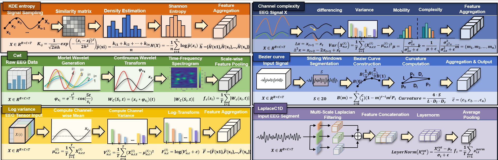
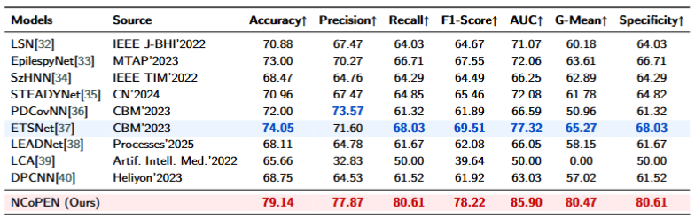

# NCoPEN: Topology-Informed Co-Encoding of Spectral Perturbations with Cross-Channel Interdependence Recomposition for EEG-Based Neurodegeneration Screening

Figure 1: Comparative depiction of functional brain connectivity and spectral distribution

Figure 2: Detailed network structure of our proposed NCoPEN.

## Methods

### NIRU

Figure 3: {Illustration of six heterogeneous feature-extraction pipelines

Figure 4: NIRU: multichannel descriptors are transformed by self-attention and then recomposed via a Gaussian mixture, yielding structurally refined embeddings for downstream reconstruction.

### PATMD

Figure 5: PATMD: perturbation kernels quantify inter-channel functional deviations; spectral–graph eigenanalysis resolves principal perturbation orientations; spectral-response projection produces the fused descriptor $F_7$.

## Installation

We run NCoPEN and previous methods on a system running Ubuntu 22.04, with Python 3.8, PyTorch 2.1.0, and CUDA 12.1.

## Experiment

### Resting-state Parkinson Dataset

Figure 6: Baseline distribution across four EEG corpora—Thessaloniki (AD/FTD/HC), CAUEEG (CN/MCI/AD), Task-state Parkinson, and Resting-state Parkinson.

Table 2: Resting-state PD–HC baselines across representative EEG networks.

Figure 7: Three-dimensional t-SNE embeddings of latent features on the Resting-State Parkinson cohort (PD vs.\ HC) across ten architectures

### Task-Induced PD Classification

Table 3: Baseline classification outcomes on the task-state Parkinson’s dataset

### Multi-Class Classification on Thessaloniki Dataset

Table 4: Quantitative assessment of regional contributions to AD classification efficacy through cortical branch-specific ablation analysis.

### Large-Scale Evaluation on CAUEEG

Table 5: CAUEEG cohort, three-class CN–MCI–AD benchmark.

Figure 8: Channel-level SHAP attribution maps with the NIRU enabled (left) versus ablated (right)

## Ablation study

### Feature-Processing Ablation

Table 6: Comparative ablation outcomes for the NIRU

### Feature-Fusion Ablation

Table 7: Comparative evaluation of feature-aggregation ablations within the PATMD module

### Classifier Ablation

Table 8: Performance comparison across ablated classifier configurations

Figure 9: Two-dimensional t-SNE embeddings of features from ablated classifiers

### Feature Extraction Ablation

Table 9: Feature extraction ablation across backbone encoders

## Model Visualization

Figure 10: Channel–wise activation heatmaps contrasting CN and PD cohorts across six feature families

Figure 11: (a) Standardized multichannel EEG with superposed saliency weights—gray, (b) Scalp-averaged channel-importance topography,(c) Band-resolved PSD maps

Figure 12: Top-3 discriminative EEG segments identified by the model

Figure 13: Decision geometry, calibration behavior, and error structure for the PD–HC classifier

# Question

if you have any questions, please contact 'yachen.wei@hdu.edu.cn'
